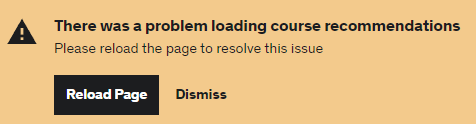

# FSB Assessment

## Scenario

1.  Go to google site
2.  Search for the keyword 'Test Automation Learning'
3.  Select the link with Udemy course
4.  Verify if the Udemy site has opened
5.  Search for BDD with Cucumber
6.  Click on the course with highest rating from the list of search results

    Task: Automate the above scenario given using JS and any tool (WebdriverIO or Selenium). The Project should be shared as a GitHub project. Each automation step should have assertions

---

## Method

- I used Webdriver IO to test this scenario. Webdriver IO is easier to read and is more concise.

- I made sure to take extra care when naming variables and spacing the automation script for this same reasoning. Creating an easily readable test saves a lot of time and trouble for the team.

- Creating a separate test for each step allowed me to make assertions at each step while also being able to pinpoint where certain tests failed, and understanding how to implement solutions in a more efficient manner.
  - In a workspace, separate tests would also create a more efficient workflow with website updates and site changes, and finding failing tests would be much easier to pinpoint.

---

## Issues

While creating this automation, there were several minor and major issues that caused some blockages in the testing of some steps.

- ### Cookies:

  - Accepting/rejecting Cookies was a minor issue when opening Google. This was easily solvable and only a minor blockage.

 

Major preventions included several security measures in the Udemy website that blocked the testing from steps 5 to 6. These included:

- ### Captcha:

  - Udemy makes use of Captcha to verify that bots are not being used on the site. This caused a blockage to the automation and did not allow WebdriverIO to get past the search page within Udemy.

- ### Rate limits:

  - Udemy implements rate limiting in order to prevent bot-like activity of the same repeated actions on their website, to prevent overwhelming effects or cause unintended behaviours by the API. At some point, the site began to stop loading courses and sometimes the website would also experiences some issues. Some screenshots are provided below.

   

---

**Example 1**: After searching in the Udemy search bar

**Example 2**: After running the test a few times

---

## Attempted Solutions

I began troubleshooting these issues in order to be able to test the last two steps of the scenario. Particularly with the Captcha, I attempted multiple solutions to bypass it for the test to be able to run, or to ensure they were working. These included:

- Creating a long browser.pause to manually solve the Captcha myself.

  - This caused the Captcha to reappear two or three times in total, and would end in the website loading for as long as the test ran.
  - A combination of the Captcha and the rate limiting proved too difficult to bypass without disabling the Captcha for the test environment with a site or secret key.

- Emulating similar testing on other websites to ensure they were correctly written.

  - I practiced writing tests for dropdown menus, verifying titles for pages and searching on other various websites.

- I considered using a cached version of the Udemy website, but after some research I quickly realised this would not work. Since it is not a current version of the site, it may not provide an accurate test of the up-to-date live website.
